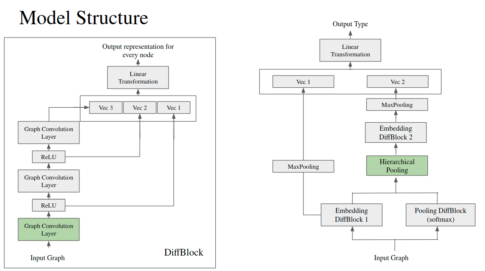
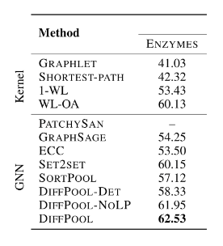

# Hierarchical Graph Representation Learning

# Requirements
* Python==3.6.x
* PyTorch==1.1.0
* NumPy>=1.16.3
* matplotlib>=3.0.3
* networkx==2.4
* tensorboardX==1.8

# DataSet & Task
ENZYMES dataset is used, which includes 600 molecule structures. The edge feature denotes whether there is a connection between two molecules and the node feature denotes what kind of element for a node.
* Classify the type of enzyme
* 600 samples (training: 540, testing: 60)
* 6 types; 100 samples per type
* the number of nodes per graph: 2 ~ 125 (median value ~ 30)
* dimension of node features: 3

# Model Structure


# Usage
```shell
python train.py --hparam_path=./config/hparams_testdb.yml # or other config files you defined
```

# Results
## Reported Results

## Replication

Best val result: 0.6133 @ epoch 765


# Reference
[1] Ying, Zhitao, et al. "Hierarchical graph representation learning with differentiable pooling." Advances in Neural Information Processing Systems. 2018.
[2] Huang, Gao, et al. "Densely connected convolutional networks." Proceedings of the IEEE conference on computer vision and pattern recognition. 2017.
